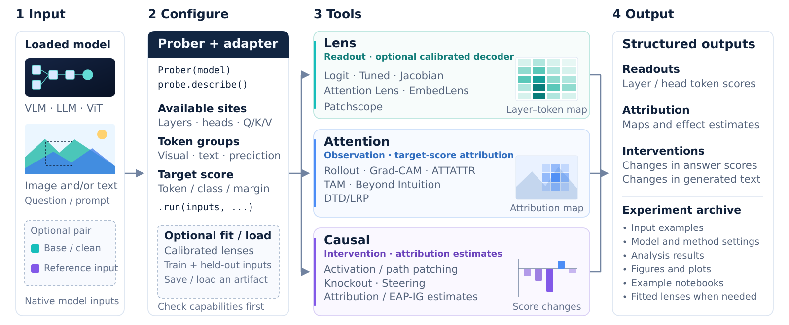

<p align="center">
  
</p>

<h1 align="center">VLM Probing</h1>

<p align="center"><strong>Exploring Model Internals Beyond the Answer</strong></p>

VLM Probing brings lens readouts, attention explanations, and causal
interventions into one model-bound interface. It supports vision-language
models, language models, and a ViT image-classification control. Bind a loaded
model once, select layers and token groups, and inspect how its internal
computation relates to a chosen answer.

- **Lens:** read vocabulary predictions from residual states, attention heads,
  or projected visual embeddings.
- **Attention:** compare attention patterns and target-conditioned spatial
  attributions on the same input.
- **Causal:** replace activations, isolate paths, block attention routes, or steer
  residual states and measure the resulting change.

Explicit adapters handle hook locations, expanded visual-token coordinates,
and model readouts. Results retain tensors and experiment metadata; shared
visualization functions turn them into heatmaps, image overlays, curves, and
connection graphs. Capability checks distinguish an unsupported operation from
a measured zero effect.

<p align="center">
  
</p>

[Documentation](docs/README.md) · [Demos](demos/README.md) ·
[Visualization](docs/VISUALIZATION.md) ·
[Technical report](https://github.com/gexinh/vlm-probing/releases/latest/download/vlm-probing-technical-report.pdf) ·
[Papers and datasets](docs/REFERENCES.md)

## Installation

Python 3.10+ and PyTorch are required. From the repository checkout:

```bash
pip install -e ".[transformers,visualization,notebooks]"
```

The Transformers extra targets Transformers 5.3.x and includes Accelerate,
Torchvision, and Pillow. Use `pip install -e .` for tensor methods and custom
PyTorch adapters; the notebooks extra supplies plotting and notebook tools.
Model weights and complete datasets are downloaded separately.

## Quick Start

This example loads **Qwen3-VL-2B-Instruct** on one CUDA GPU. Replace
`example.jpg` with your image, or use an image from [the bundled demos](demos/README.md).

```python
import torch
from PIL import Image
from transformers import AutoModelForImageTextToText, AutoProcessor
from vlm_probing import Prober

model_id = "Qwen/Qwen3-VL-2B-Instruct"
model = AutoModelForImageTextToText.from_pretrained(
    model_id, dtype=torch.bfloat16, device_map={"": "cuda:0"},
    attn_implementation="eager",
)
processor = AutoProcessor.from_pretrained(model_id)
probe = Prober(model, processor)

messages = [{"role": "user", "content": [
    {"type": "image"},
    {"type": "text", "text": "What is in this image?"},
]}]
prompt = processor.apply_chat_template(
    messages, tokenize=False, add_generation_prompt=True,
)
inputs = probe.prepare(
    prompt=prompt, image=Image.open("example.jpg").convert("RGB"), device="cuda:0",
)

print(probe.describe()["methods"]["lens.logit"])
result = probe.lens.logit(layers=[0, 13, 27], tokens="last_prompt").run(inputs)
token_id = result.tensors["logits"][-1, 0].argmax().item()
print(processor.tokenizer.decode([token_id]))
result.save("outputs/logit_lens")

# Read projected image tokens in the input embedding space.
visual = probe.lens.embed(tokens="visual").run(inputs, top_k=5)

# Observe the attention actually used by the language decoder.
attention = probe.attention.profile(
    layers=[27], queries="last_prompt", include_attention=True,
).run(inputs)
```

Use a model you have already loaded, and pass its native processor dictionary
directly to `.run(...)` when convenient. Layer indices are zero-based; tokens
refer to the expanded sequence, including image positions. The
[model guides](docs/models/README.md) explain each architecture's input contract.

```python
from vlm_probing import visualization as viz

answer_id = processor.tokenizer.encode(" yellow", add_special_tokens=False)[0]
ax = viz.plot_lens_heatmap(result, target_token_id=answer_id)
ax.figure.savefig("outputs/lens.png", bbox_inches="tight")
```

This plots one vocabulary token's rank across selected layers and positions.
A complete answer can contain several tokens; choose the intended subword
explicitly, or use complete-answer metrics for interventions.

| Common operation | Purpose |
| --- | --- |
| `Prober(model, processor=None)` | Bind a caller-owned model and resolve its adapter. |
| `probe.describe()` | Inspect available methods, sites, and missing capabilities. |
| `probe.prepare(prompt=..., image=..., device=...)` | Convert formatted text and images into native inputs. |
| `probe.lens / probe.attention / probe.causal` | Configure a method in one of three families. |
| `method.run(inputs, ...)` | Execute a probe and return `ProbeResult`. |
| `method.fit_batches(...)` / `method.load(...)` | Calibrate or restore Tuned/Attention Lens; Jacobian Lens has a separate estimator. |
| `result.save(directory)` | Save CPU tensors and JSON metadata. |

[The API guide](docs/API.md) covers selectors, complete-answer metrics,
paired-input alignment, and result shapes. [Visualization](docs/VISUALIZATION.md)
describes reusable plotting functions. The [demos](demos/README.md) include
saved real measurements and input images for offline replay; rerunning a model
is an explicit option. A [small CPU example](examples/prober_quickstart.py)
exercises the API without downloading pretrained weights.

## Model Support

Eight VLM families have explicit adapters. Text-only GPT-2/Llama and a ViT
classifier provide complementary controls. Availability is method-specific;
see the [capability matrix](docs/models/README.md).

| Family | Example checkpoint | Guide |
| --- | --- | --- |
| Qwen3-VL | Qwen3-VL-2B-Instruct | [Usage](docs/models/qwen3_vl.md) |
| Qwen2.5-VL | Qwen2.5-VL-3B-Instruct | [Usage](docs/models/qwen2_5_vl.md) |
| Qwen2-VL | Qwen2-VL-2B-Instruct | [Usage](docs/models/qwen2_vl.md) |
| Qwen3.5 | Qwen3.5-4B; hybrid attention restrictions | [Usage](docs/models/qwen3_5.md) |
| SmolVLM | SmolVLM-500M-Instruct | [Usage](docs/models/smolvlm.md) |
| InternVL | InternVL3-1B-hf | [Usage](docs/models/internvl.md) |
| LLaVA | llava-1.5-7b-hf | [Usage](docs/models/llava.md) |
| Pixtral | Pixtral-12B-2409 | [Usage](docs/models/pixtral.md) |
| Language models | GPT-2 / Llama | [GPT-2](docs/models/gpt2.md) · [Llama](docs/models/llama.md) |
| Vision classifier | ViT-B/16 | [Usage](docs/models/vit.md) |

## Methods

Each guide explains the implemented computation, parameters, outputs, and
relationship to its original paper. Reusable primitives are labeled separately
from paper methods.

| Family | Method guides |
| --- | --- |
| Lens | [Logit](docs/methods/logit_lens.md) · [Tuned](docs/methods/tuned_lens.md) · [Attention Lens](docs/methods/attention_lens.md) · [Jacobian](docs/methods/jacobian_lens.md) · [EmbedLens](docs/methods/embed_lens.md) · [Patchscopes](docs/methods/patchscope.md) |
| Attention | [Rollout](docs/methods/attention_rollout.md) · [Grad-CAM, ATTATTR, TAM, Beyond Intuition](docs/methods/attention_maps.md) · [Generic relevance](docs/methods/attention_relevance.md) · [ViT DTD/LRP](docs/methods/chefer_lrp.md) |
| Causal | [Activation patching](docs/methods/activation_patching.md) · [IOI-style path patching](docs/methods/path_patching.md) · [Attribution patching](docs/methods/attribution_patching.md) · [Attention Knockout](docs/methods/attention_knockout.md) · [EAP / EAP-IG](docs/methods/eap_ig.md) · [Residual steering / VSV](docs/methods/steering.md) |
| Supporting tools | [Attention profile](docs/methods/attention_profile.md) · [Head logit attribution](docs/methods/head_logit_attribution.md) · [Probability reweighting](docs/methods/attention_reweight.md) · [Temperature](docs/methods/attention_temperature.md) |

## Package Architecture

```text
src/vlm_probing/
  prober.py       # shared model-bound entry point
  api/           # method factories, capture and replay
  adapters/      # explicit architecture and token-layout contracts
  lenses/        # BaseLens and concrete readout methods
  attention/     # BaseAttention and concrete attention methods
  causal/        # BaseCausal and concrete interventions/estimators
  training/      # calibration, checkpoint import and resume
  visualization/ # shared heatmaps, overlays, curves and graphs
  core/          # results and execution traces
demos/           # runnable notebooks, compact measurements and input images
docs/            # model, method, API and source guides
```

Family base classes keep algorithm implementations small; adapters let them
share model execution. [Architecture](docs/ARCHITECTURE.md) and
[adapter contracts](docs/ADAPTERS.md) describe these boundaries.

## References

The [paper and dataset index](docs/REFERENCES.md) links the original method
papers, author implementations, and datasets used for demonstrations and lens
calibration. The
[technical report](https://github.com/gexinh/vlm-probing/releases/latest/download/vlm-probing-technical-report.pdf)
compares real readouts, explanations, and interventions on shared cases across
five pretrained VLMs, with language and vision controls.
