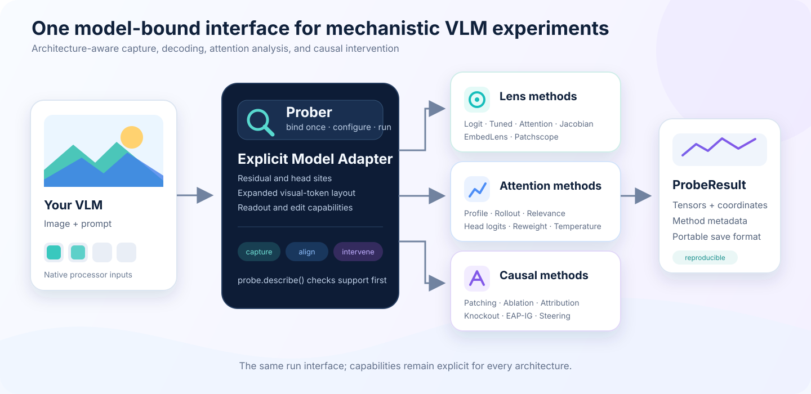

<p align="center">
  
</p>

<h1 align="center">VLM Probing</h1>

<p align="center">
  <strong>A model-aware toolkit for inspecting and intervening in vision-language models.</strong>
</p>

Modern VLMs expose hidden states and attention tensors, but turning those tensors
into a valid experiment still requires architecture-specific knowledge: where
visual tokens enter the language model, which residual state a layer index names,
whether an attention tensor is editable, and how an intermediate state reaches
the vocabulary. VLM Probing puts these details behind explicit, tested adapters.

Bind a model once, inspect its capabilities, and ask three kinds of questions
through one consistent `.run(inputs)` interface:

- **What is represented?** Decode layers, heads, and visual tokens with lens methods.
- **Where does information flow?** Measure attention patterns and cross-token paths.
- **What changes the answer?** Patch, ablate, attribute, or steer internal states.

The library currently provides 18 methods and automatic adapters for seven VLM
families. Every result preserves layer and token coordinates, experiment metadata,
and the distinction between observational readouts and causal interventions.
Models outside the built-in set can be connected through the same explicit
adapter contract.

<p align="center">
  
</p>

[Documentation](docs/README.md) · [Models](docs/models/README.md) ·
[Methods](docs/methods/README.md) · [Papers](docs/REFERENCES.md)

## Installation

Requires Python 3.10+ and PyTorch. From this checkout:

```bash
pip install -e ".[transformers]"
```

The Hugging Face extra installs Transformers 5.3.x, PyTorch 2.4+, Torchvision,
Accelerate, and Pillow.
Use `pip install -e .` for tensor methods and custom PyTorch adapters only.

## Quick Start

This example uses **Qwen3.5-4B** on one CUDA GPU. Replace `example.jpg` with
your image. See the [Qwen3.5 guide](docs/models/qwen3_5.md) for supported layers.

```python
import torch
from PIL import Image
from transformers import AutoModelForImageTextToText, AutoProcessor
from vlm_probing import Prober

model_id = "Qwen/Qwen3.5-4B"
model = AutoModelForImageTextToText.from_pretrained(
    model_id,
    dtype=torch.bfloat16,
    device_map={"": "cuda:0"},
    attn_implementation="eager",
)
processor = AutoProcessor.from_pretrained(model_id)
probe = Prober(model, processor)

messages = [{"role": "user", "content": [
    {"type": "image"},
    {"type": "text", "text": "What is in the image?"},
]}]
prompt = processor.apply_chat_template(
    messages, tokenize=False, add_generation_prompt=True, enable_thinking=False,
)
inputs = probe.prepare(
    prompt=prompt, image=Image.open("example.jpg").convert("RGB"), device="cuda:0",
)

# Inspect capabilities without running the model.
print(probe.describe()["methods"]["lens.logit"])

# Decode the next-token prediction at selected language layers.
result = probe.lens.logit(layers=[7, 15, 31], tokens="last_prompt").run(inputs)
print(result.tensors["logits"].shape)      # [layers, selected positions, vocabulary]
print(result.tensors["positions"])        # [batch index, expanded token index]
print(processor.tokenizer.decode(result.tensors["logits"][-1, 0].argmax().item()))
result.save("outputs/logit_lens")

# Read visual tokens in the input embedding space.
visual = probe.lens.embed(tokens="visual").run(inputs, top_k=5)

# Qwen3.5 has standard attention at layers 3, 7, ..., 31.
attention = probe.attention.profile(layers=[3], queries="last_prompt").run(inputs)
```

The same entry point accepts a model you have already loaded. Pass a native
dictionary of model inputs directly to `.run(...)`, or use `prepare` with a
processor. Layers are zero-based; results use detached CPU tensors by default.

| Common operation | Purpose |
| --- | --- |
| `Prober(model, processor=None)` | Bind a model and resolve its adapter. |
| `probe.describe()` | List available methods, layer sites, and capability requirements. |
| `probe.prepare(prompt=..., image=..., device=...)` | Process formatted text and images into model inputs. |
| `probe.lens / probe.attention / probe.causal` | Configure a method from one of three families. |
| `method.run(inputs, ...)` | Execute a probe and return tensors with metadata. |
| `method.fit(inputs, ...)` | Calibrate Tuned, Attention, or Jacobian Lens before use. |
| `result.save(directory)` | Save `tensors.pt` and `metadata.json`. |

See the [API guide](docs/API.md) for token selection, metrics, fitted-lens
artifacts, and result shapes. A [CPU example](examples/prober_quickstart.py)
runs all 18 methods without downloading model weights.

## Model Support

Each model page includes loading, image preparation, probing examples, and
validation scope. [Full capability matrix →](docs/models/README.md)

| Model family | Example checkpoint | Usage |
| --- | --- | --- |
| Qwen3.5 | Qwen3.5-4B | [Guide](docs/models/qwen3_5.md) |
| Qwen3-VL | Qwen3-VL-2B-Instruct | [Guide](docs/models/qwen3_vl.md) |
| Qwen2.5-VL | Qwen2.5-VL-3B-Instruct | [Guide](docs/models/qwen2_5_vl.md) |
| Qwen2-VL | Qwen2-VL-2B-Instruct | [Guide](docs/models/qwen2_vl.md) |
| SmolVLM | SmolVLM-256M-Instruct | [Guide](docs/models/smolvlm.md) |
| InternVL | InternVL3-1B-hf | [Guide](docs/models/internvl.md) |
| LLaVA | llava-1.5-7b-hf | [Guide](docs/models/llava.md) |

## Methods

Each link opens usage examples, parameters, outputs, and implementation scope.

| Family | Method documentation |
| --- | --- |
| Lens | [Logit](docs/methods/logit_lens.md) · [Tuned](docs/methods/tuned_lens.md) · [Attention Lens](docs/methods/attention_lens.md) · [Jacobian](docs/methods/jacobian_lens.md) · [EmbedLens](docs/methods/embed_lens.md) · [Patchscope](docs/methods/patchscope.md) |
| Attention | [Profile](docs/methods/attention_profile.md) · [Head logit attribution](docs/methods/head_logit_attribution.md) · [Rollout](docs/methods/attention_rollout.md) · [Relevance](docs/methods/attention_relevance.md) · [Reweighting](docs/methods/attention_reweight.md) · [Temperature](docs/methods/attention_temperature.md) |
| Causal | [Activation patching](docs/methods/activation_patching.md) · [Ablation](docs/methods/ablation.md) · [Attribution patching](docs/methods/attribution_patching.md) · [Attention knockout](docs/methods/attention_knockout.md) · [EAP-IG](docs/methods/eap_ig.md) · [Steering](docs/methods/steering.md) |

## Package Structure

```text
src/vlm_probing/
├── prober.py       # Public model-bound entry point
├── api/            # LensMethods, AttentionMethods, CausalMethods
├── adapters/       # Model contracts, token layouts, scoped hooks
├── lenses/         # BaseLens and six algorithm subclasses
├── attention/      # BaseAttention and six algorithm subclasses
├── causal/         # BaseCausal and six algorithm subclasses
├── core/           # BaseMethod, ProbeResult, ForwardTrace
└── metrics.py      # Token-margin and sequence-log-probability scores
```

The public collections handle capture and execution; algorithm subclasses handle
tensor computations. Adapters isolate architecture-specific behavior.
[Architecture](docs/ARCHITECTURE.md) · [Custom adapters](docs/ADAPTERS.md)

## References

The [paper index](docs/REFERENCES.md) links implemented methods to their papers,
original implementations, and the scope reproduced here.
