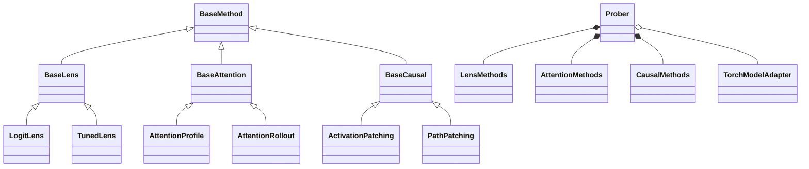

# Package Architecture

[Home](../README.md) / [Documentation](README.md)

The package separates a convenient model-bound API from reusable algorithms and
explicit model contracts.

```text
Prober(model, processor)
    ├── LensMethods       → configured lens → run(inputs)
    ├── AttentionMethods  → configured probe → run(inputs)
    └── CausalMethods     → configured intervention → run(inputs)
                  │
          adapter + ModelSpec
          capture / layout / intervention / readout
                  │
          concrete tensor algorithm
                  │
          ProbeResult(tensors, metadata)
```

## Class hierarchy



The diagram shows representative subclasses. Concrete algorithms and optional
paper-specific backends are indexed in the [method guides](methods/README.md).
The facade uses composition over this hierarchy, so new model support does not
require another copy of every algorithm.

## Module responsibilities

| Module | Responsibility |
| --- | --- |
| `prober.py` | Model binding, processor convenience, capability reports. |
| `api/` | Configure methods, collect activations, score/replay edits, pack results. |
| `adapters/spec.py` | Explicit residual/head/attention sites and expanded token semantics. |
| `adapters/torch.py` | Scoped hooks, readout, state restoration, capture validation. |
| `adapters/auto.py` | Exact-class registration and model-provided adapter protocol. |
| `adapters/huggingface.py` | Explicit contracts for eight VLM families, Llama, and GPT-2. |
| `adapters/vit.py` | Pure-vision classifier outputs, patch layouts and editable attention. |
| `_vendor/chefer2021/` | Minimal pinned author DTD rules, with license and provenance. |
| `lenses/`, `attention/`, `causal/` | Family base classes, tensor algorithms, and controlled forward algorithms. |
| `training/` | Persistent distribution fitting, checkpoint import, and Jacobian calibration. |
| `visualization/` | Shared heatmaps, overlays, intervention curves, and edge diagrams. |
| `core/`, `metrics.py` | Shared results, traces, and output scoring. |

Residual interventions run independently per layer by default. Steering and
knockout accept `joint=True`: all selected sites edit their live tensors in one
forward, so later layers recompute from earlier interventions. `VisualSteering`
constructs image-specific directions in two forwards and uses this shared API.
The native GPT-2 `TransformerEAPIG` provider supplies independent residual
messages and original input-embedding integration, plus circuit evaluation.
Propagation combines an
unbroken prefix of attention layers; Qwen3.5's linear-attention gaps cannot be
treated as missing-but-ignorable matrices. HF residual captures include
Qwen3-VL's post-block DeepStack additions.

`PathProbe` binds inputs, layouts, endpoints, and metrics to `PathPatching`, a
`BaseCausal` subclass. The kernel performs four actual forwards with separate
hook lifetimes: base, donor, controlled head-output freeze, and receiver-only
replay. `HeadSite` explicitly declares physical head axes; `ModelSpec.path_heads`
must cover every decoder layer to preserve the IOI control rule.

Adapters restore model training flags and remove their hooks after success or
failure. Unknown architectures and missing intervention sites fail before use.
See [adapter contracts](ADAPTERS.md), [the API](API.md), and
[model validation scope](models/README.md).
