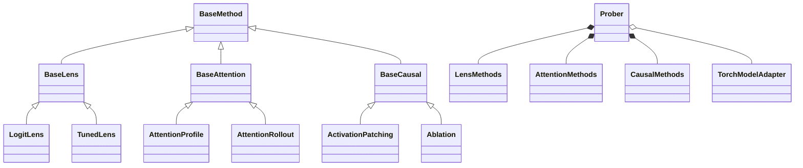

# Package Architecture

[Home](../README.md) / [Documentation](README.md)

The package separates a convenient model-bound API from reusable algorithms and
explicit model contracts.

```text
Prober(model, processor)
    ├── LensMethods       → configured lens → run(inputs)
    ├── AttentionMethods  → configured probe → run(inputs)
    └── CausalMethods     → configured intervention → run(inputs)
                  │
          adapter + ModelSpec
          capture / layout / intervention / readout
                  │
          concrete tensor algorithm
                  │
          ProbeResult(tensors, metadata)
```

## Class hierarchy



The diagram shows representative subclasses. Each algorithm family has six
concrete subclasses, indexed in the [method guides](methods/README.md).
The facade uses composition over this hierarchy, so new model support does not
require another copy of every algorithm.

## Module responsibilities

| Module | Responsibility |
| --- | --- |
| `prober.py` | Model binding, processor convenience, capability reports. |
| `api/` | Configure methods, collect activations, score/replay edits, pack results. |
| `adapters/spec.py` | Explicit residual/head/attention sites and expanded token semantics. |
| `adapters/torch.py` | Scoped hooks, readout, state restoration, capture validation. |
| `adapters/auto.py` | Exact-class registration and model-provided adapter protocol. |
| `adapters/huggingface.py` | Shared execution with explicit contracts for seven VLM families and Llama. |
| `lenses/`, `attention/`, `causal/` | Family base classes and tensor algorithm subclasses. |
| `core/`, `metrics.py` | Shared results, traces, and output scoring. |

Residual interventions run independently per layer. Propagation combines an
unbroken prefix of attention layers; Qwen3.5's linear-attention gaps cannot be
treated as missing-but-ignorable matrices. HF residual captures include
Qwen3-VL's post-block DeepStack additions.

Adapters restore model training flags and remove their hooks after success or
failure. Unknown architectures and missing intervention sites fail before use.
See [adapter contracts](ADAPTERS.md), [the API](API.md), and
[validation scope](releases/v0.3.0.md).
